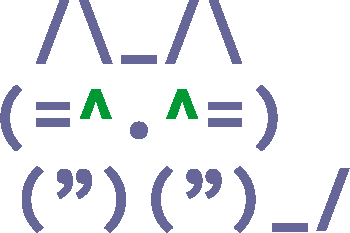

    
    
    _________            ______________               
    __  ____/_______________  __ \__  /_____ _____  __
    _  /    _  __ \_  ___/_  /_/ /_  /_  __ `/_  / / /
    / /___  / /_/ /(__  )_  ____/_  / / /_/ /_  /_/ /
    \____/  \____//____/ /_/     /_/  \__,_/ _\__, /  
    🕹 2D ASCII Game Engine for Scala3        /____/
    

[](https://raw.githubusercontent.com/apache/opennlp/master/LICENSE)
[](https://github.com/nivanov/cosplay/actions/workflows/build.yml)

## What is CosPlay?
CosPlay is 2D ASCII game engine written in [Scala3](https://www.scala-lang.org/):
* Free, open source and royalty free
* First truly native ASCII/ANSI game engine
* Freedom of JVM runtime ecosystem 
* Native support for any ANSI terminal on macOS, Windows, Linux, Unix, or z/OS
* 8-bit and "True Color" 24-bit color modes
* Advanced sprite-based animation
* Camera focus tracking 
* Extensive 2D ASCII graphics support
* Powerful user-programmable shaders
* Built-in particle effects support
* Extensive imaging support including [REXPaint](https://www.gridsagegames.com/rexpaint) format
* Multi-channel audio & ASCII-video support
* 277 built-in FIGLet fonts with full rendering
* Built-in log viewer, debugger and terminal emulator

## Install
Prerequisites:
* Java 11+ ([download](https://www.java.com/en/download/))

Using [Maven](https://mvnrepository.com/artifact/org.cosplayengine/cosplay):
```xml
<dependency>
  <groupId>org.cosplayengine</groupId>
  <artifactId>cosplay</artifactId>
  <version>0.1.1</version>
</dependency>
```
Using Scala SBT:
```scala
libraryDependencies += "org.cosplayengine" % "cosplay" % "0.1.1"
```

## Questions?
* Join [discord](https://discord.gg/gDQuYJDM)
* Post a question at [Stack Overflow](https://stackoverflow.com/questions/ask) using <code>cosplay</code> tag
* File a bug or improvement in [GitHub Issues](https://github.com/nivanov/cosplay/issues)
* Join project on [GitHub](https://github.com/nivanov/cosplay/issues)

## Copyright
Copyright (C) 2021 Rowan Games, Inc.




